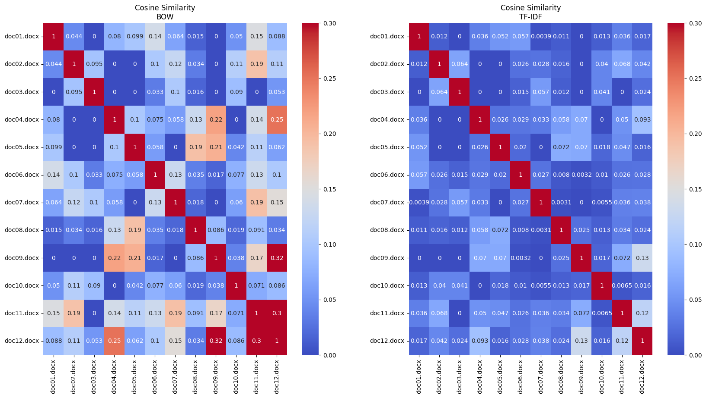

# Similitud de Documentos con Representaciones Vectoriales

 

## Introducción

Este proyecto explora dos técnicas fundamentales para la representación y análisis de texto en tareas de procesamiento de lenguaje natural (NLP): **Bag of Words (BoW)** y **TF-IDF (Term Frequency-Inverse Document Frequency)**. Estas técnicas son ampliamente utilizadas en problemas como la clasificación de texto, análisis de similitud y recuperación de información.

El objetivo del proyecto es representar documentos como vectores, calcular similitudes entre ellos y analizar las diferencias en los resultados obtenidos utilizando BoW y TF-IDF. Para ello, se trabaja con un conjunto de documentos relacionados con tecnología móvil y vehículos eléctricos, preprocesados mediante técnicas de tokenización y eliminación de palabras comunes.

 

## Representación Vectorial de Documentos

### Bag of Words (BoW)

El modelo **BoW** representa un documento como un vector donde:
- Cada dimensión corresponde a una palabra única del vocabulario del corpus.
- El valor en cada dimensión es la frecuencia de aparición de esa palabra en el documento.

Matemáticamente, el vector $ \mathbf{v}_d $ de un documento $ d $ se define como:

$$
\mathbf{v}_d[i] = \text{frecuencia de la palabra } w_i \text{ en el documento } d
$$

#### Construcción de BoW
1. **Tokenización**: Se dividen los textos en palabras individuales y se eliminan palabras comunes (*stopwords*).
2. **Construcción del vocabulario**: Se forma un conjunto de palabras únicas presentes en todos los documentos.
3. **Vectorización**: Para cada documento, se calcula el número de veces que aparece cada palabra del vocabulario, generando un vector de frecuencias.

### TF-IDF

**TF-IDF** es una extensión de BoW que pondera las palabras en función de:
1. **Frecuencia de la palabra en el documento (TF)**: Representa cuántas veces aparece una palabra en un documento en relación con la longitud del documento:

$$
\text{TF}(w, d) = \frac{\text{frecuencia de } w \text{ en } d}{\text{número total de palabras en } d}
$$

2. **Frecuencia inversa de documentos (IDF)**: Mide cuán única es una palabra en el corpus:

$$
\text{IDF}(w) = \log\left(\frac{N}{\text{número de documentos que contienen } w}\right)
$$

   Donde $ N $ es el número total de documentos en el corpus.

El valor TF-IDF para una palabra $ w $ en un documento $ d $ se calcula como:

$$
\text{TF-IDF}(w, d) = \text{TF}(w, d) \times \text{IDF}(w)
$$

#### Ventajas de TF-IDF
- Reduce el peso de palabras comunes en el corpus (como "y", "de").
- Resalta palabras más relevantes para cada documento.

 

## Similitud entre Documentos

Para comparar documentos, se utiliza la **similitud coseno**, que mide la similitud entre dos vectores como el coseno del ángulo entre ellos:

$$
\text{Similitud coseno}(\mathbf{v}_a, \mathbf{v}_b) = \frac{\mathbf{v}_a \cdot \mathbf{v}_b}{\|\mathbf{v}_a\| \|\mathbf{v}_b\|}
$$

Donde:
- $ \mathbf{v}_a \cdot \mathbf{v}_b $ es el producto escalar.
- $ \|\mathbf{v}_a\| $ y $ \|\mathbf{v}_b\| $ son las magnitudes de los vectores.

Los valores oscilan entre:
- $ 1 $: Máxima similitud (vectores idénticos).
- $ 0 $: Sin similitud (vectores ortogonales).

 

## Análisis y Visualización

### Representación BoW
Se construye una matriz de similitud coseno para los documentos utilizando sus representaciones BoW. La matriz muestra cómo de similares son los documentos entre sí, destacando relaciones temáticas como:
- Documentos sobre tecnología móvil tienden a ser más similares entre ellos.
- Documentos relacionados con vehículos eléctricos tienen menor similitud con los de otra categoría.

### Representación TF-IDF
Con la matriz TF-IDF, los valores de similitud coseno reflejan relaciones más precisas:
- Palabras comunes y menos relevantes tienen menor impacto.
- Documentos similares en términos de contenido reciben puntuaciones más altas.

Comparando ambas matrices, TF-IDF tiende a encontrar menos similitudes espurias, ya que elimina el ruido asociado a palabras comunes.

 

## Conclusiones

1. **BoW vs TF-IDF**:
   - BoW es una representación básica que captura frecuencias de palabras pero ignora la importancia relativa de estas.
   - TF-IDF mejora la representación al considerar tanto la frecuencia local como la global, destacando palabras relevantes.

2. **Similitud coseno**:
   - Una métrica eficiente para comparar representaciones vectoriales.
   - Permite agrupar documentos similares y detectar documentos aislados.

3. **Aplicaciones**:
   - Clasificación automática de texto.
   - Recuperación de información y búsqueda de documentos relevantes.
   - Análisis temático de grandes colecciones de texto.

Este proyecto ilustra cómo técnicas simples como BoW y TF-IDF, junto con la similitud coseno, pueden ofrecer una base poderosa para tareas de minería de texto y procesamiento de lenguaje natural.